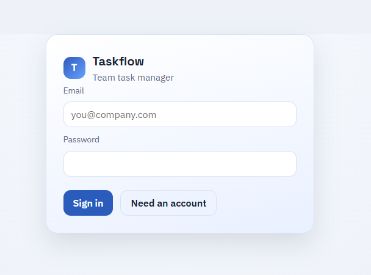
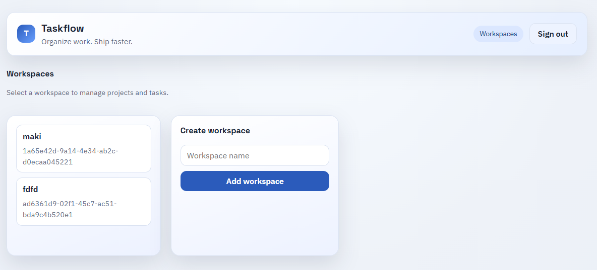
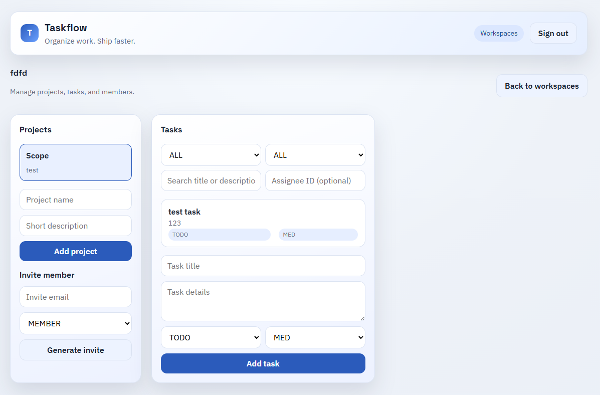
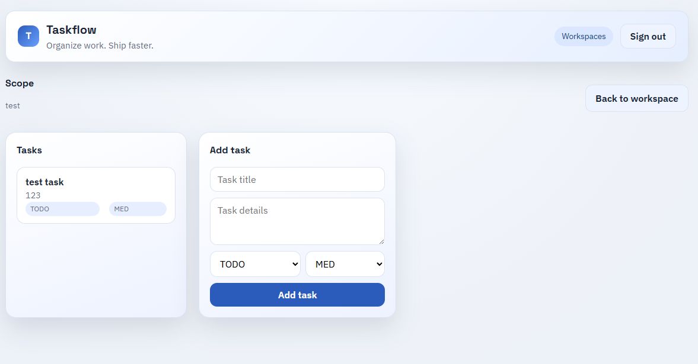
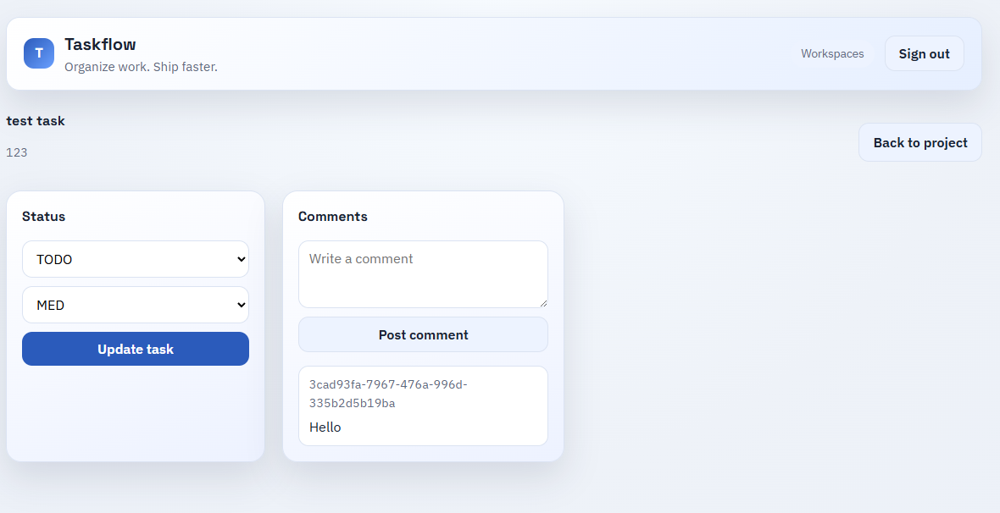
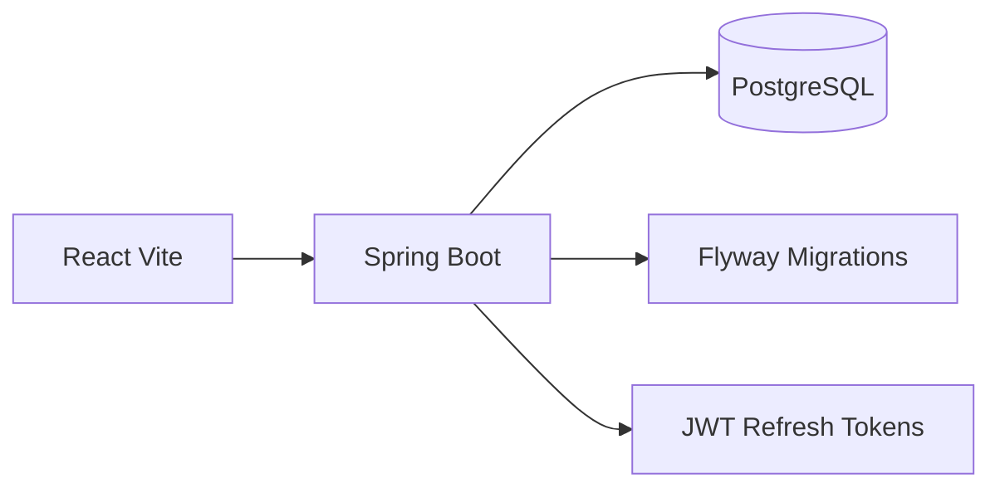

# Taskflow

Team Task API (mini Asana) built for local-first demos. Includes multi-tenancy, RBAC, invites, comments, and a clean React UI.

## Highlights

- Multi-tenant workspaces with role-based access control
- Projects, tasks, and comments with filtering and pagination
- Invite flow with token acceptance
- JWT auth + refresh tokens
- Flyway migrations + PostgreSQL
- Swagger docs + integration tests + CI

## Screenshots

Login



Workspaces


Workspace


Project


Task


## Demo

Local demo flow:
1) Register or sign in
2) Create a workspace and project
3) Add tasks, filter, and comment
4) Invite a member and verify role permissions

## Tech Stack

- Backend: Java 17, Spring Boot, JPA, Flyway
- Database: PostgreSQL
- Frontend: React + Vite
- Docs: Swagger (Springdoc OpenAPI)
- Tests: Testcontainers, JUnit
- CI: GitHub Actions

## Architecture



## Local Setup

1) Start Postgres:

```bash
docker compose up -d
```

2) Run the backend:

```bash
cd backend
./mvnw spring-boot:run
```

3) Run the frontend:

```bash
cd frontend
npm install
npm run dev
```

Frontend: http://localhost:5173  
Swagger: http://localhost:8080/swagger-ui/index.html  
Health: http://localhost:8080/actuator/health

## Testing

Run integration tests (requires Docker running):

```bash
cd backend
mvn test
```

## API Notes

Key endpoints:
- `POST /auth/register`
- `POST /auth/login`
- `POST /auth/refresh`
- `POST /workspaces`
- `POST /workspaces/{id}/projects`
- `POST /projects/{id}/tasks`
- `POST /tasks/{id}/comments`
- `POST /workspaces/{id}/invites`
- `POST /invites/accept?token=...`

## Environment

Frontend API base (optional):

```
VITE_API_URL=http://localhost:8080
```

